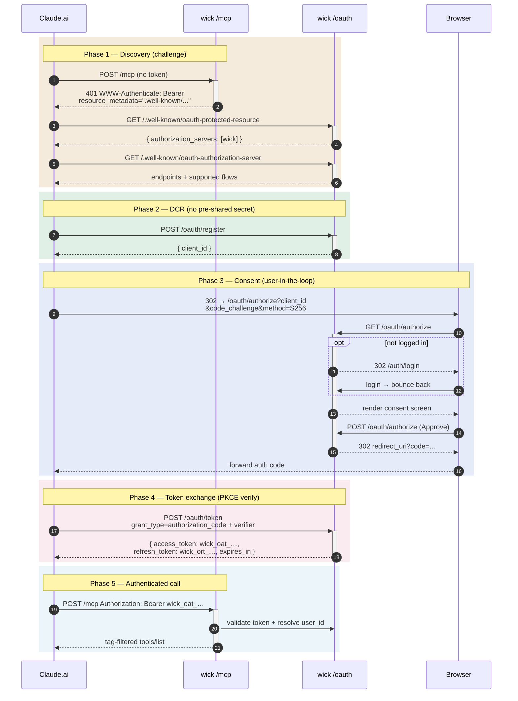

# OAuth Connections

OAuth 2.1 with Dynamic Client Registration (DCR) and PKCE — wick implements the server side, so MCP clients that speak OAuth (Claude.ai, browser-based agents) connect with zero pre-registration. The user pastes one URL, approves a consent screen, and the client takes care of token caching and refresh on its own.

For clients that cannot speak OAuth (Claude Desktop, Cursor, cURL), use [Personal Access Tokens](./access-tokens) instead.

## Why self-hosted?

Wick runs its own authorization server at `/oauth/{authorize,token,register}` — it does not delegate to Auth0, Clerk, or Keycloak. Reasons:

- Wick already has a user table, session cookie, and Google SSO. Reusing those keeps the dependency surface small.
- Tokens are opaque (not JWT) — no key management, no JWKS rotation, no signing-secret blast radius.
- DCR + PKCE is part of OAuth 2.1; no external identity provider needed.

Trade-off: you carry the authorization server's operational responsibility (cert renewal at the load balancer, audit log retention). For most internal-tool deployments this is a wash — wick already runs.

## OAuth dance

Five phases, color-coded. Hover any arrow for the exact HTTP call; click a participant to jump to the relevant reference.

::: tip Phase legend
**Discovery** → client learns where to register · **DCR** → register without admin · **Consent** → user approves in browser · **Token exchange** → PKCE proves same client · **Authenticated call** → bearer token passed on every MCP call
:::

### Token formats

| Token | Wire format | TTL | Issued at | Stored as |
|-------|-------------|-----|-----------|-----------|
| Access | `wick_oat_<32hex>` | 1 hour | `/oauth/token` (initial + refresh) | SHA-256 hash |
| Refresh | `wick_ort_<64hex>` | 30 days | `/oauth/token` (initial + each refresh) | SHA-256 hash, with `parent_token_id` chain |
| Authorization code | (one-shot) | 5 minutes | `POST /oauth/authorize` consent submit | SHA-256 hash |

Refresh tokens **rotate** — every successful exchange mints a fresh refresh token and revokes the previous one via the `parent_token_id` chain. Replay of a previously-rotated refresh token revokes the entire chain (the OAuth 2.1 best-current-practice for refresh-token replay detection).

PKCE S256 is **mandatory**. Wick rejects `code_challenge_method=plain` per the OAuth 2.1 spec.

## Consent screen

*`/oauth/authorize` consent page — app name, scope summary, Approve/Deny buttons.*

Wick renders `/oauth/authorize` with:

- The requesting client's name (from DCR registration).
- A scope summary describing what the client will be able to do ("Call connectors visible to your account via MCP").
- Approve and Deny buttons.

Denying is sticky for the duration of the auth code TTL (5 minutes) — the client gets `error=access_denied` and the code is never minted.

## Manage active connections

*`/profile/connections` table — App name · Granted at · Last used · Disconnect.*

`/profile/connections` lists every active OAuth grant for the logged-in user — one row per (user × OAuth client) that has at least one valid access or refresh token.

Click **Disconnect** on a row to revoke every token (access + refresh) issued to that client for this user. The client must re-do the full OAuth dance to regain access — it cannot silently refresh from cached tokens.

This is per-grant, not per-token: disconnecting one PAT does not affect OAuth grants, and disconnecting an OAuth grant does not affect PATs.

## Admin override

*`/admin/connections` cross-user grant table with admin Disconnect buttons.*

`/admin/connections` is the cross-user view. Admins see every active OAuth grant across every user and can disconnect any of them — useful when:

- A user has left the team and needs all their MCP-attached clients severed.
- A specific OAuth client has been identified as compromised and every user's grant for it must be revoked at once.

The audit per call still flows through `connector_runs` — see the [history page](./connector-module#history-page).

## Token compromise — what to do

If you suspect an OAuth grant has been compromised:

1. **Revoke immediately** at `/profile/connections` (own grant) or `/admin/connections` (someone else's).
2. **Revoke any PATs** the same user holds at `/profile/tokens` if there's any chance the leak was broader. PATs do not auto-rotate.
3. **Audit recent calls** at `/admin/connectors` → pick the row → History tab. Filter by user.
4. **Rotate upstream credentials** if the connector wraps an API whose secret is stored in `connectors.configs`. The grant itself does not give the attacker that secret (configs are server-side), but if the attacker can call connectors, they can exfiltrate via response payloads.

## Common questions

**Can I extend the access-token TTL beyond 1 hour?** Not configurable today. The 1h / 30d split balances refresh frequency against blast radius.

**Why 1 hour for access vs 30 days for refresh?** Access is hot — passed on every MCP call, easy to leak. Short TTL limits exposure. Refresh stays in the client's secret store and crosses the wire only on rotation, so a longer TTL is safe.

**What happens at token rotation?** The client calls `/oauth/token` with `grant_type=refresh_token` and the current refresh. Wick mints a new pair, marks the old refresh token as rotated (`parent_token_id` set on the new), and returns the pair. The client persists the new pair and discards the old. If anyone tries to use the old refresh again, wick walks the chain via `parent_token_id` and revokes every descendant.

**Can multiple users share an OAuth client?** Yes — DCR registers the client; each user goes through their own consent. A grant is `(user_id, client_id)` — one client, many user grants.

**Can I disable DCR?** Not via configuration today. DCR is the OAuth 2.1 standard for public clients; turning it off would force every user to ask an admin to register their client manually.

## Reference

- OAuth 2.1 draft: <https://datatracker.ietf.org/doc/draft-ietf-oauth-v2-1/>
- DCR (RFC 7591): <https://www.rfc-editor.org/rfc/rfc7591>
- Authorization Server Metadata (RFC 8414): <https://www.rfc-editor.org/rfc/rfc8414>
- Protected Resource Metadata (RFC 9728): <https://www.rfc-editor.org/rfc/rfc9728>
- PAT alternative: [Access Tokens](./access-tokens)
- Implementation: [`internal/docs/connectors-design.md`](https://github.com/yogasw/wick/blob/master/internal/docs/connectors-design.md) section 8
