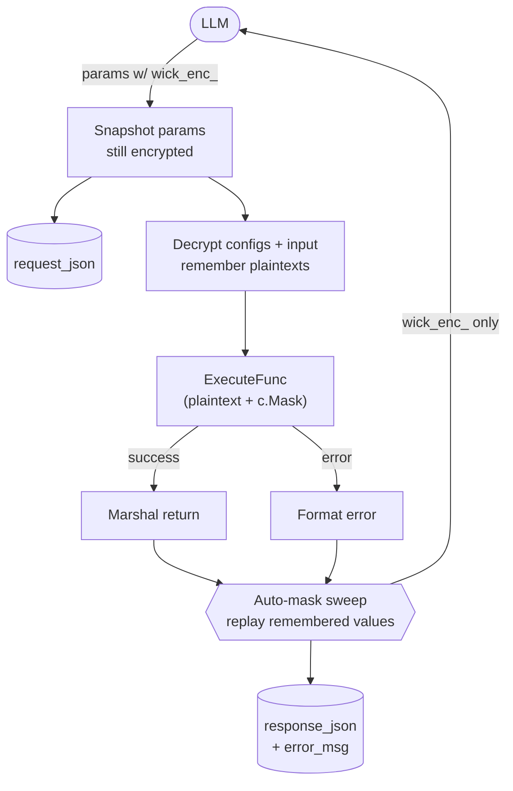

# Encrypted Fields

Wick has a built-in encrypted-fields layer that lets credentials and other sensitive values flow between an LLM and a connector without ever appearing as plaintext in the LLM's context window or in the connector run audit log. The mechanism is opt-in per field via the `secret` tag — connectors that don't carry sensitive data are unaffected.

## Why it exists

Connectors often need to surface a credential to the LLM so it can pass that credential into a follow-up tool call. Sending the value as plaintext means:

- The model provider sees it in the request body.
- It lands verbatim in `connector_runs.response_json` (audit log).
- If the LLM caches the response, the value persists longer than intended.

The encrypted-fields layer wraps every sensitive value in a `wick_enc_<base64url>` token before the response leaves wick, and unwraps any token in the input before `ExecuteFunc` runs. The connector code is unchanged — it always sees plaintext.

## Token format

```
wick_enc_<base64url(nonce ‖ AES-256-GCM(plaintext, nonce, derived_key))>
```

- **Prefix `wick_enc_`** — distinct from any other format wick or common upstream APIs emit.
- **Nonce** — 12 random bytes, prepended to the ciphertext so encrypts with the same key+plaintext don't collide.
- **Derived key** — `HKDF(master_key, salt=user_uuid, info="wick-enc")`, 32 bytes. The `info` parameter scopes this HKDF use so future HKDF callers within wick can never collide.

A token issued for user A cannot be decrypted under user B's session — the derived key differs. SSO/OAuth and PAT auth both resolve to `user_uuid` through wick's existing auth middleware.

## Where masking happens

`connectors.Service.Execute` is the single chokepoint. Around every call:



Identical plaintext within one response receives the same token (per-call dedup cache), so the LLM does not mistake duplicates for distinct credentials.

The auto-mask sweep at the end pulls plaintexts from three sources, deduped:

1. **Decrypted-from-token** — every plaintext produced by decrypting an incoming `wick_enc_` token in the configs or input map. Tracked regardless of whether the receiving field carries the `secret` tag, because the LLM contract says `wick_enc_` is opaque and may be passed into any field. Without this, a connector that echoes a non-secret field would silently leak plaintext the moment the LLM forwarded a token to it.
2. **`secret`-tagged plaintexts** — every Configs/Input field tagged `secret`, taken post-decrypt (covers values stored in plaintext, e.g. via the admin form).
3. **Values passed to `c.Mask` / `c.MaskIgnoreCase`** — anything the connector explicitly tagged as sensitive mid-call. The framework remembers these and applies them to the whole response, so a value the connector masked in one field also gets masked if it leaks into another field of the same response.

The list lives on a per-call adapter inside `internal/connectors`. Connectors and any other code outside that package cannot read it back — the only public surface is `c.Mask` (write-only from the connector's view).

### The "connector forgot to mask" guarantee

The most common worry is: *what if the connector returns a value that should have been masked but wasn't?* The middleware covers the two paths where that risk is real:

| Scenario | What protects you |
|----------|-------------------|
| LLM passed `wick_enc_X` into a field. Connector decrypts via `c.Input(...)` (transparent), uses the plaintext, and accidentally returns it raw in the response. | Source #1 above. Every plaintext produced by decrypting an inbound token is in the sweep list — the response gets re-masked even if the connector did nothing about it. |
| Connector pulls a sensitive value from upstream, calls `c.Mask` on one place where it appears, but a *different* response field also carries the same value. | Source #3 above. `c.Mask` records the values, then the post-Execute sweep re-applies them to the entire marshaled response. |
| Connector wraps a credential into an error string (`fmt.Errorf("...token=%s", c.Cfg("token"))`) and returns it. | Same sweep runs over the error message before it reaches the caller and the audit log. |

The guarantee does **not** stretch to channels the framework cannot see — `c.ReportProgress`, structured logs, side-effect writes (DB, queue, file). For those, mask before emitting.

## Marking a field as sensitive

Add `secret` to the field's `wick:"..."` tag in your `Configs` or per-op `Input` struct:

```go
type Creds struct {
    Endpoint string `wick:"required"`
    APIKey   string `wick:"required;secret"`
}

type RefreshInput struct {
    RefreshToken string `wick:"required;secret"`
}
```

That's the only code change needed for the common case. Wick reflects the tag at boot via `entity.StructToConfigs`, the `IsSecret` flag flows into the Config row, and `connectors.Service.Execute` reads it back when collecting sensitive values to mask.

There is no min-length floor — admins are responsible for making sure sensitive fields don't carry generic values like `"true"`, `"1"`, or short IDs that would substring-match all over the response.

The `secret` tag still matters even though decrypt-then-echo is now caught regardless of tag: it is the only signal that covers a credential the admin pasted in **as plaintext** (no `wick_enc_` token at any point). For credentials that always travel as tokens you'd be safe with or without the tag, but tagging consistently keeps the form rendering masked and the audit trail clean.

## Dynamic values: `c.Mask` / `c.MaskIgnoreCase`

For sensitive values that are NOT in `Configs` or `Input` — e.g. a session token returned by an upstream login API — call `c.Mask` before returning. Use `c.MaskIgnoreCase` when keyword matching should fold case (e.g. "Admin" and "admin" share one token):

```go
func login(c *connector.Ctx) (any, error) {
    req, _ := http.NewRequestWithContext(c.Context(), "POST", c.Cfg("endpoint")+"/login", body)
    resp, err := c.HTTP.Do(req)
    if err != nil { return nil, err }
    defer resp.Body.Close()

    raw, _ := io.ReadAll(resp.Body)
    var result struct {
        SessionToken string `json:"session_token"`
        ExpiresAt    string `json:"expires_at"`
    }
    json.Unmarshal(raw, &result)

    masked := c.Mask(string(raw), []string{result.SessionToken})
    return masked, nil
}
```

`c.Mask(data, values)` and `c.MaskIgnoreCase(data, values)` are bound to the calling user's per-user key automatically; connectors never see the user UUID. When wick is booted without the encrypted-fields layer (tests) or with `WICK_ENC_DISABLE=true`, the call is a passthrough.

Side effect worth knowing: every value passed to `c.Mask` is also remembered for the post-Execute auto-mask sweep. So if a connector calls `c.Mask(loggedFragment, []string{token})` to scrub one field, then later returns a struct where a different field happens to contain the same token, the second occurrence is masked too. The connector does not need to thread the same value into both places manually.

## Manual UI: `/tools/encfields`

Two pages, both gated behind login:

| Path | Purpose |
|------|---------|
| `/tools/encfields` | Encrypt — paste plaintext, copy back the `wick_enc_` token |
| `/tools/encfields/decrypt` | Decrypt — paste a `wick_enc_` token, see the plaintext |

Submission is JSON-only via `fetch()` — the page never reloads, so browser back goes straight to wherever the user came from (typically the home grid). Per-user keys mean only the user who issued a token can decrypt it; admins cannot reveal another user's tokens.

Use cases:

- Pre-generate a `wick_enc_` value to paste into a connector config field, so the credential is never plaintext in the DB.
- Debug a `wick_enc_` token a user is reporting issues with — by re-encrypting the same plaintext under your own session and comparing, or by asking the user to paste their token into their own session.

## MCP integration: redirect, never decrypt

Three meta-tools relate to the encrypted-fields layer:

| Tool | Behavior |
|------|----------|
| `wick_execute` | Tool description carries the contract: values prefixed with `wick_enc_` are valid credentials managed by the server. The LLM passes them through unchanged; wick decrypts internally before `ExecuteFunc` runs and re-encrypts on the way out. |
| `wick_encrypt` | Returns `{ "url": ".../tools/encfields", "message": "..." }`. The LLM is instructed to give the URL to the user — encryption never runs over MCP. |
| `wick_decrypt` | Returns `{ "url": ".../tools/encfields/decrypt", "message": "..." }`. Same flow, in reverse. Per-user keys mean only the issuing user can decrypt. |

The reason `wick_encrypt` / `wick_decrypt` redirect rather than executing the cipher: running the crypto inline would put either the plaintext (encrypt) or the user-revealed value (decrypt) into the LLM's context window — exactly the leakage the layer exists to prevent.

## Audit trail

| Column | Content |
|--------|---------|
| `connector_runs.request_json` | Params **before** decrypt — stores `wick_enc_` tokens verbatim, so retry-from-history works under the retrier's key. |
| `connector_runs.response_json` | Response **after** mask — already redacted, no plaintext anywhere. |
| `connector_runs.error_msg` | Error message **after** mask — same sweep as response_json, so a connector that wraps a credential into `fmt.Errorf` does not leak via the audit row. |

Plaintext never lands in the audit log.

## Operator knobs

| Env var | Effect |
|---------|--------|
| `WICK_ENC_KEY` | Hex-encoded 32-byte master key. Wins over the DB-stored key when set — production injects from a vault here so the secret never lives in the DB. |
| `WICK_ENC_DISABLE` | `true` / `1` / `yes` / `on` → disables encryption entirely (every call is a passthrough). Use only when the deployment has no LLM-facing surface. |

DB-stored key lives at `configs.encryption_key` (auto-generated on first boot, regeneratable from `/admin/advanced`). Rotation invalidates every existing `wick_enc_` token — that's by design and acceptable because LLM sessions don't persist tokens long-term.

## Common pitfalls

- **Tagging a generic value `secret`.** A field whose value is `"true"`, `"1"`, `"abc"`, or a short ID will substring-match all over the response and silently mint tokens for noise. Pick distinct values for sensitive fields. The same applies to a `wick_enc_` token whose plaintext is generic — round-trip auto-mask will substring-scan the response for it.
- **Manually calling `EncryptValue` in `ExecuteFunc`.** Don't — let the framework do it via the `secret` tag (auto-mask) or `c.Mask` / `c.MaskIgnoreCase` (dynamic). Manual encrypt risks shipping a token to a place the LLM was already fine with plaintext for, breaking subsequent tool calls.
- **Logging or progress-reporting plaintext.** Auto-mask covers the response and the error message returned from `ExecuteFunc`. If you also write to `c.ReportProgress`, structured logs, or a queue, mask those yourself first.
- **Detached goroutines that outlive `ExecuteFunc`.** The auto-mask sweep snapshots the remembered plaintexts the moment `ExecuteFunc` returns. A goroutine you spawned but did not wait for can call `c.Mask` afterwards — that mask still scrubs whatever string the goroutine itself produced, but values it adds to the per-call list arrive too late to scrub the main response. Join your goroutines before returning, or do the masking inside them.
- **Generic plaintexts behind `wick_enc_` tokens.** The decrypt-then-remember path now feeds every token plaintext into the substring sweep regardless of tag. A token whose plaintext is `"true"`, `"1"`, or a 3-character ID will substring-match noise across the response and silently mint tokens for unrelated fields. Don't issue tokens for generic values.
- **Trying to decrypt over MCP.** `wick_decrypt` deliberately returns a URL — the cipher never runs in the LLM's context window. Direct the user there.

## See also

- [MCP for LLMs](../guide/mcp) — encrypted-fields section
- [Connector Module](../guide/connector-module) — `Configs` struct + `secret` tag
- [Config Tags](./config-tags) — full tag grammar
