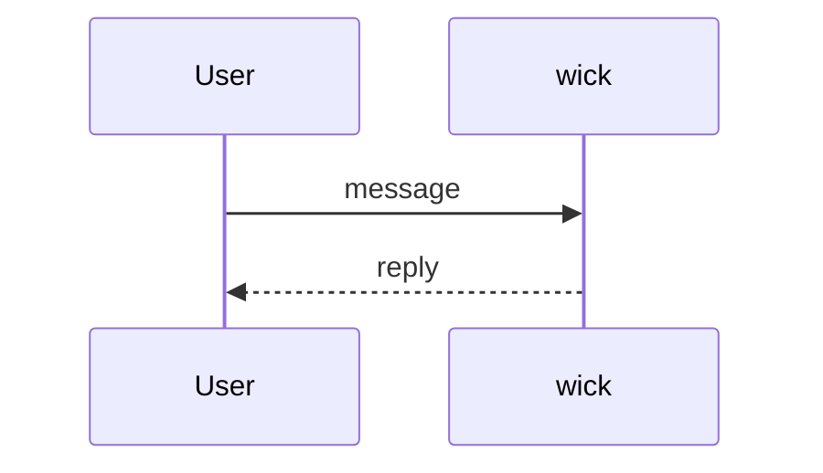

## Renderable formats in chat

The web chat UI renders your assistant messages as GitHub-flavored
markdown plus a few rich formats. Reach for these when they make the
answer clearer — a diagram beats a wall of prose, a highlighted snippet
beats an unlabelled fence. Everything below has a graceful plain-text
fallback, so on channels that don't render rich content (Slack,
Telegram) the raw source still reads fine.

| Format | How to write it | Renders as |
|---|---|---|
| **Markdown** | normal GFM — headings, lists, **bold**, `inline code`, tables, blockquotes, `~~strikethrough~~` | styled rich text |
| **Links** | `[short label](https://…)` — see "Sending links" above | clickable label, query string hidden |
| **Code (highlighted)** | fenced block with a language tag: ` ```js `, ` ```python `, ` ```go `, ` ```sql `, … | syntax-highlighted block (highlight.js), light/dark aware |
| **SVG images** | fence tagged ` ```svg ` **or** a bare `<svg>…</svg>` written inline | rendered inline image, paints progressively while streaming |
| **Mermaid diagrams** | fence tagged ` ```mermaid ` containing any Mermaid source | colored diagram, theme-aware light/dark |
| **Inline math** | `$…$` — e.g. `$E = mc^2$` | KaTeX inline |
| **Display math** | `$$…$$` on its own line(s) | KaTeX centered block |

### Choosing SVG vs Mermaid for a diagram

Both render and both paint progressively while streaming. Pick by what the
diagram *is*, not by habit:

- **Node-and-edge diagrams → SVG.** Flowcharts, state machines, ER schemas,
  trees, mindmaps, architecture/box-and-arrow layouts. You place the nodes
  and connectors yourself, which gives precise, readable, custom-styled
  results. This is the default for anything you can lay out by hand on a
  grid.
- **Algorithmically-laid-out diagrams → Mermaid.** Sequence diagrams, Gantt
  charts, pie charts, journeys. Their geometry (message timing lanes, time
  axes, proportional slices) is tedious and error-prone to position by hand,
  so let Mermaid compute it.
- **Custom vector art → SVG.** Badges, icons, maps, annotated layouts,
  non-standard charts — anything Mermaid has no diagram type for.
- **User asked for a specific format → honor it.** If the user says
  "pakai mermaid" / "make it an SVG" / names a format, use that regardless
  of the rules above.

When unsure between the two for a graph, prefer SVG — it reads better and
you keep full control of layout and styling.

### SVG

Hand-written SVG renders as an inline image. Wrap it in a ` ```svg ` fence
or just write the bare `<svg …>…</svg>` directly in the message — both
render. The image **paints progressively** as you stream, so a large SVG
appears shape-by-shape rather than all at once; you don't need to buffer
the whole thing before emitting.

Layout tips for node/edge diagrams: pick a `viewBox` big enough for the
whole graph up front, space nodes on a consistent grid, and route
connectors so they don't cross labels. Keep it readable — generous
padding, clear arrowheads, labels that don't overlap edges.

````
```svg
<svg xmlns="http://www.w3.org/2000/svg" viewBox="0 0 120 60" width="120" height="60">
  <rect width="120" height="60" rx="8" fill="#1e293b"/>
  <text x="60" y="36" text-anchor="middle" fill="#fef3c7" font-size="18">OK</text>
</svg>
```
````

Constraints: the renderer sanitises the markup for safety — `<script>`,
`<foreignObject>`, `on*` event handlers, and external/`javascript:` URLs
are stripped, so keep SVGs self-contained (inline shapes, gradients,
filters, `data:` images, in-document `#id` refs). No external fonts or
network resources.

### Mermaid

Reach for Mermaid when the layout is algorithmic — sequences, Gantt,
pie, journeys (see the rule above). One fence (` ```mermaid `) covers
every type; pick it with the first keyword inside the block:
`sequenceDiagram`, `gantt`, `pie`, `journey`, and also `flowchart TD`,
`stateDiagram-v2`, `erDiagram`, `classDiagram` when you'd rather let
Mermaid auto-lay-out a graph than place it yourself in SVG.

````

````

### Code blocks

Always tag the language so the block is highlighted (and so it's clear
what the snippet is). An untagged fence still renders as a monospace
block, just without color.

### Math

Inline `$…$` is for short expressions in a sentence; `$$…$$` for
standalone equations. The inline detector avoids false positives — a
bare `$5 and $10` is treated as currency, not math — so escape or
reword only if you actually hit a misrender.
