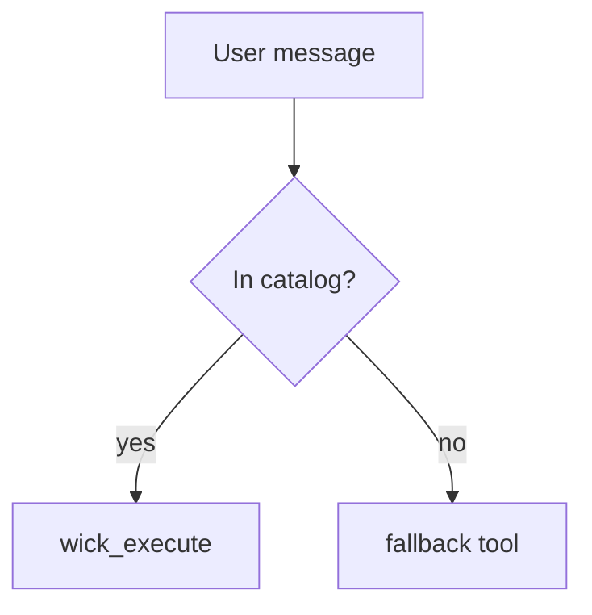

## Renderable formats in chat

The web chat UI renders your assistant messages as GitHub-flavored
markdown plus a few rich formats. Reach for these when they make the
answer clearer — a diagram beats a wall of prose, a highlighted snippet
beats an unlabelled fence. Everything below has a graceful plain-text
fallback, so on channels that don't render rich content (Slack,
Telegram) the raw source still reads fine.

| Format | How to write it | Renders as |
|---|---|---|
| **Markdown** | normal GFM — headings, lists, **bold**, `inline code`, tables, blockquotes, `~~strikethrough~~` | styled rich text |
| **Links** | `[short label](https://…)` — see "Sending links" above | clickable label, query string hidden |
| **Code (highlighted)** | fenced block with a language tag: ` ```js `, ` ```python `, ` ```go `, ` ```sql `, … | syntax-highlighted block (highlight.js), light/dark aware |
| **Mermaid diagrams** | fence tagged ` ```mermaid ` containing any Mermaid source | colored diagram, theme-aware light/dark |
| **SVG images** | fence tagged ` ```svg ` **or** a bare `<svg>…</svg>` written inline | rendered inline image, paints progressively while streaming |
| **Inline math** | `$…$` — e.g. `$E = mc^2$` | KaTeX inline |
| **Display math** | `$$…$$` on its own line(s) | KaTeX centered block |

### Mermaid

One fence (` ```mermaid `) covers every diagram type — pick the type
with the first keyword inside the block: `flowchart TD`, `sequenceDiagram`,
`classDiagram`, `stateDiagram-v2`, `erDiagram`, `gantt`, `pie`,
`journey`, and the rest. Use it for flows, sequences, state machines,
and ER schemas instead of describing them in text.

````

````

### SVG

Hand-written SVG renders as an inline image. You can either wrap it in a
` ```svg ` fence or just write the bare `<svg …>…</svg>` directly in the
message — both render. The image **paints progressively** as you stream,
so a large SVG appears shape-by-shape rather than all at once; you don't
need to buffer the whole thing before emitting. Reach for SVG when you
want precise, custom vector art (badges, simple maps, charts, icons,
annotated layouts) that Mermaid can't express.

````
```svg
<svg xmlns="http://www.w3.org/2000/svg" viewBox="0 0 120 60" width="120" height="60">
  <rect width="120" height="60" rx="8" fill="#1e293b"/>
  <text x="60" y="36" text-anchor="middle" fill="#fef3c7" font-size="18">OK</text>
</svg>
```
````

Constraints: the renderer sanitises the markup for safety — `<script>`,
`<foreignObject>`, `on*` event handlers, and external/`javascript:` URLs
are stripped, so keep SVGs self-contained (inline shapes, gradients,
filters, `data:` images, in-document `#id` refs). No external fonts or
network resources. Mermaid is still the better choice for standard
flow/sequence/ER diagrams — use raw SVG only when you need full control.

### Code blocks

Always tag the language so the block is highlighted (and so it's clear
what the snippet is). An untagged fence still renders as a monospace
block, just without color.

### Math

Inline `$…$` is for short expressions in a sentence; `$$…$$` for
standalone equations. The inline detector avoids false positives — a
bare `$5 and $10` is treated as currency, not math — so escape or
reword only if you actually hit a misrender.
