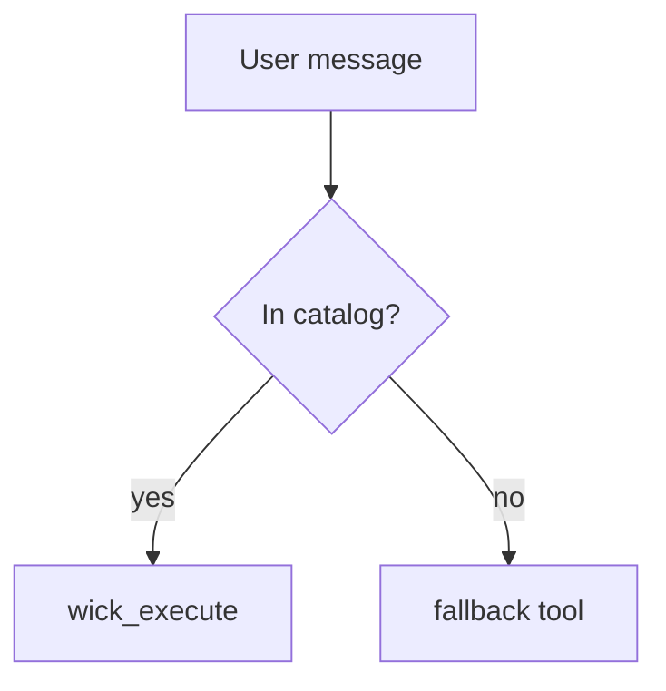

## Renderable formats in chat

The web chat UI renders your assistant messages as GitHub-flavored
markdown plus a few rich formats. Reach for these when they make the
answer clearer — a diagram beats a wall of prose, a highlighted snippet
beats an unlabelled fence. Everything below has a graceful plain-text
fallback, so on channels that don't render rich content (Slack,
Telegram) the raw source still reads fine.

| Format | How to write it | Renders as |
|---|---|---|
| **Markdown** | normal GFM — headings, lists, **bold**, `inline code`, tables, blockquotes, `~~strikethrough~~` | styled rich text |
| **Links** | `[short label](https://…)` — see "Sending links" above | clickable label, query string hidden |
| **Code (highlighted)** | fenced block with a language tag: ` ```js `, ` ```python `, ` ```go `, ` ```sql `, … | syntax-highlighted block (highlight.js), light/dark aware |
| **Mermaid diagrams** | fence tagged ` ```mermaid ` containing any Mermaid source | colored diagram, theme-aware light/dark |
| **Inline math** | `$…$` — e.g. `$E = mc^2$` | KaTeX inline |
| **Display math** | `$$…$$` on its own line(s) | KaTeX centered block |

### Mermaid

One fence (` ```mermaid `) covers every diagram type — pick the type
with the first keyword inside the block: `flowchart TD`, `sequenceDiagram`,
`classDiagram`, `stateDiagram-v2`, `erDiagram`, `gantt`, `pie`,
`journey`, and the rest. Use it for flows, sequences, state machines,
and ER schemas instead of describing them in text.

````

````

### Code blocks

Always tag the language so the block is highlighted (and so it's clear
what the snippet is). An untagged fence still renders as a monospace
block, just without color.

### Math

Inline `$…$` is for short expressions in a sentence; `$$…$$` for
standalone equations. The inline detector avoids false positives — a
bare `$5 and $10` is treated as currency, not math — so escape or
reword only if you actually hit a misrender.
